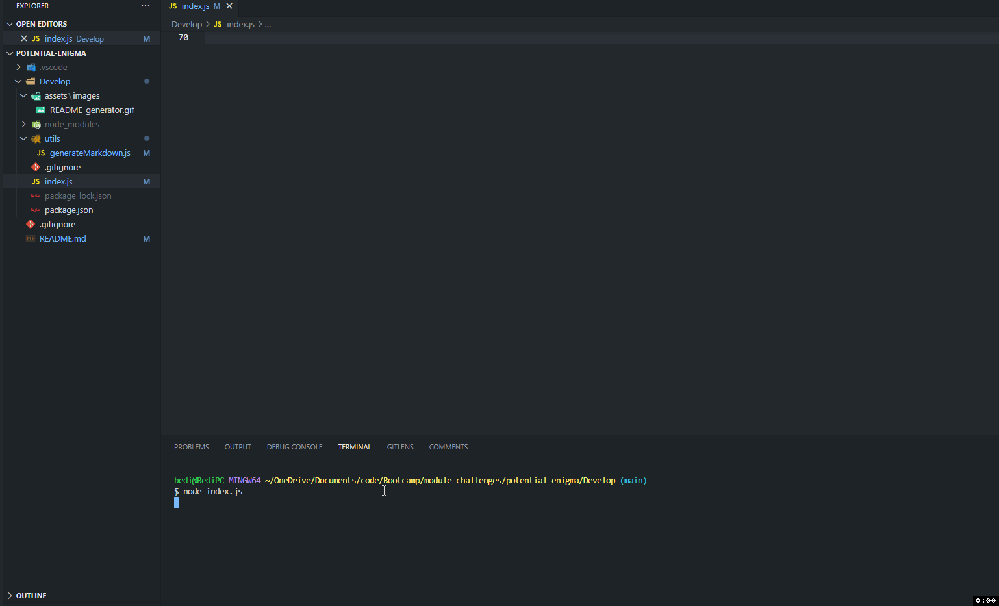

# README Generator




## Description

This Node app lets users quickly spin up a README markdown file. It accepts user input to different prompts and outputs a README file.

## Technologies Used

- [x] Node.js
- [x] Inquirer NPM Library
- [x] fs standard Node Library

## Usage

```
Fill out the prompt questions regarding the info about your project that you want to generate for the README file.
```

```
Add a README file will be outputted in the directory of the project with all the selected user input.
```

## Installation

```
clone the repo to local machine
```

Change directories into /README-generator

```
cd /README-generator
```

Then change directories into /Develop

```
cd /Develop
```

Then run:

```
node index.js
```
